<center><h1>Lubuntu16.4.3定制教程</h1></center>
<center>迟思堂工作室 李迟(li@latelee.org)</center>
  
  
本文是对lubuntu-16.04.3-desktop-amd64.iso进行定制文档，最终输出一个可以烧写到U盘并能启动的ISO镜像文件。本文要求读者对linux有一定掌握程度，比如：知道用户权限（root权限）、知道如何使用apt-get install安装软件，知道shell。本文注重的是制作的方法，另外有做好的定制脚本文件，具体参考工程仓库内文件。工程仓库里的图标、配置文件显示的字符串可能与本文有出入，最终以读者自行判断的为准。  
如无特殊说明：  
本文提到的命令，都是用root执行的。  
本文所述“启动系统”、“重启系统”、“ISO启动”等，都是指“启动iso，进入livecd环境”。  
本文假定读者能自由切换sudo和root，并能自由切换“/”和“\”。  
本文工程项目仓库地址：[https://github.com/cststudio/lubuntucd](https://github.com/cststudio/lubuntucd) ，下文将其为“工程”或“工程仓库”。  

# 1、环境搭建
制作iso镜像，需要使用一台linux系统，可以是物理机，也可以是虚拟机，只要保证安装有相应的工具即可。本文使用的系统是12核至强处理器，64GB内存的ubuntu 16.04 64bit。CPU核心数越多，制作ISO镜像越快（本文所用系统制作ISO耗时大约1分钟左右）。  
就制作过程而言，需要使用的工具安装步骤如下： 
```
sudo apt-get install squashfs-tools 
sudo apt-get install mkisofs  
sudo apt install xorriso  
sudo apt-get install isolinux  
```
说明：  
squashfs-tools主要用于解压、压缩squash文件系统的（ISO光盘使用这种格式）。  
mkisofs 和xorriso主要用于制定ISO镜像文件。  
isolinux主要用于生成isohdpfx.bin。安装该工具后，在/usr/lib/ISOLINUX/下面会有isohdpfx.bin，这个文件是我们在制定ISO时使用到的，需要将其拷贝到指定目录。该文件已经整合到工程仓库里了。  


# 2、文件说明
制作过程需要使用大量命令，为了简化其人工输入的失误，因此，在解压ISO、制作ISO过程中，均使用脚本来实现。  
本文工程使用的主要文件和目录说明如下：  
* 1_tar_iso.sh：解压专用。用于将原始ISO（即从官网下载的镜像）解压，得到rootfs文件。  
* 2_tar_splash.sh ：解压splash、bootlogo相关文件。  
* 3_build_splash.sh：：更新并重新制作splash、bootlogo相关文件。
* update.sh：更新ISO镜像（即本文的定制部分将通过此脚本完成，当然也可以手工一步步完成）。  
* 4_build_iso.sh：制作ISO镜像专用。用于将修改后rootfs打包、制作成新的ISO镜像。  
* work：工作目录，包括自定义图片、修改后的配置文件、语言文件、isohdpfx.bin文件，等等。  
细节请自行查阅文件。  

# 3、制作步骤
一般来说，制作过程分几个阶段：  
1. 下载镜像文件lubuntu-16.04.3-desktop-amd64.iso，将这个镜像文件和脚本文件（1_tar_iso.sh、2_tar_splash.sh等)放置同一个目录。
2. 解压原始镜像文件。此阶段使用1_tar_iso.sh脚本进行（注意：后面我们定制时，是基于已经解压的iso文件，因此，这个阶段就不再需要了）。执行脚本：
```
./1_tar_iso.sh
```
3. 自定义制作。此阶段根据实际情况不同而不同。文后主要在此阶段进行说明、演示。
4. 重新制作ISO镜像。此阶段使用4_build_iso.sh脚本进行。执行脚本：
```
./ 4_build_iso.sh
```  
测试我们重新制定的ISO有2种方式。第一种是使用虚拟机vmware软件，新建一个虚拟机，然后使用新生成的iso，启动即可看到效果。这种方法在初期阶段建议，因为比较快看到效果。第二种是使用烧写工具将ISO烧写到U盘，从U盘启动，查看效果。烧写工具因系统不同而不同，这里介绍的是在Linux系统中烧写方式。  
将U盘插入计算机的USB口，使用  
```
ls /dev/sd*
```
查看。一般来说，只有一块硬盘的计算机，/dev/sda即为该硬盘的设备文件（盘符），而/dev/sdb就是U盘的设备文件。简单记忆就是sda表示系统识别到的第一块磁盘，sdb是第二块，sdc为第三块，等等。本文使用的系统有2块硬盘，因此U盘的设备文件为/dev/sdc。烧写命令如：  
```
dd if=lubuntu-16.04.3-desktop-amd64.iso of=/dev/sdc
```
其中if表示要烧写的镜像文件，这里是lubuntu-16.04.3-desktop-amd64.iso，of表示要烧写的U盘设备文件。  


# 4、定制过程
为了行文简便，本节定制过程，仅仅是描述要定制的流程，不重复涉及解压iso、重新制定iso的过程，请参考第三章节。凡是演示有效果图的，均是重新制作ISO，然后再启动ISO系统。  
本文定制的镜像、脚本，统一放到/home/latelee/iso目录。ISO真正内容位于squashfs-root目录。该目录由脚本固定，本文使用该目录来描述，如果实际目录不同，目录名跟着变化即可。本节涉及路径都在/home/latelee/iso目录下面，比如  
```
squashfs-root/usr/share/lubuntu/wallpapers  
```
实际在系统的全路径为：  
```
/home/latelee/iso/squashfs-root/usr/share/lubuntu/wallpapers  
```
为了编写高效，有时会使用windows系统，比如存放图片、修改图片等等，会使用“\”分隔符，在本文中，不区别对待“/”和“\”，在真正操作时，请时刻记住在linux下是“/”的。  
实践小结：  
建议部分重要文件使用chroot进入squashfs-root来编辑。  
比如ISO光盘中的/usr/share/plymouth/themes/lubuntu-text/lubuntu-text.plymouth文件，是链接到/etc/alternatives/text.plymouth的。  
如果在主机上查看/etc/alternatives/text.plymouth，该文件却链接到/usr/share/plymouth/themes/xubuntu-text/xubuntu-text.plymouth。  
因为本文是使用ubuntu来定制lubuntu，所以会出现这种情况。如果主机也是lubuntu，则不会这样。但是，如果不小心改错了ISO里面的文件，还是会影响主机的使用的。  
下图是默认的lubuntu桌面：   
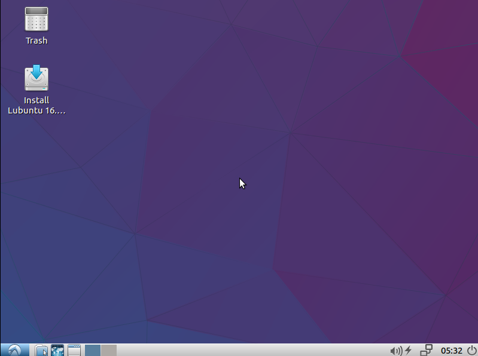

## 4.1 桌面背景图片
### 4.1.1 背景图片
目录：squashfs-root \usr\share\lubuntu\wallpapers  
默认是图片名称：lubuntu-default-wallpaper.png  
分辨率：2560X1600  
【定制】：  
将自己喜欢的图片（最好保持分辨率），放到此目录，并修改为lubuntu-default-wallpaper.png。原来的图片可以删除可重命名。  
### 4.1.2 菜单的logo图
目录：squashfs-root \usr\share\lubuntu\images  
默认名称：1604-lubuntu-logo.png  
分辨率：56x24  
【定制】：  
将自己喜欢的图片（最终保持分辨率），放到此目录，并修改为1604-lubuntu-logo.png。原来的图片可以删除可重命名。  
注：squashfs-root \usr\share\lubuntu\images 目录下的1604-logout-banner.png是登出显示的logo图片。  
定制效果如下图所示：  
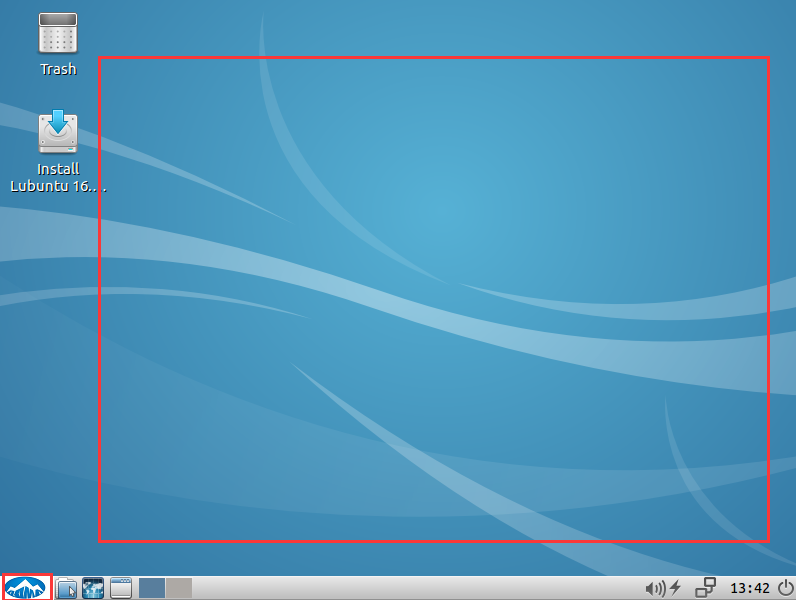


## 4.2 系统关机显示的图标
目录：squashfs-root\usr\share\plymouth\themes\lubuntu-logo  
文件：lubuntu_logo.png  
分辨率：217X58  
直接替换该文件即可。  

## 4.3 开机文字和图片
开机文字和图片是livecd启动正式系统前进行显示的。内容位于newiso目录。  
开机文字涉及目录：newiso\isolinux  
开机图片涉及文件：newiso\casper\initrd.lz  
修改过程十分复杂，已经制作成脚本，参考2_tar_splash.sh和3_build_splash.sh。修改的图片、文件放到work\splash目录。下面介绍有关文件：
en.tr、txt.cfg、zh_CN.tr、zh_TW.tr：开机文字文件(.tr文件部分为二进制，部分为正常字符串，笔者使用notepad++对正常字符串进行修改)，需要将修改后的文件放到newiso\isolinux目录，同时也要重新制定该目录的bootlogo文件。
splash.pcx：开机选择安装系统时显示的图片，pcx格式（用photoshop可修改、保存。注：相同分辨率，大小不同，开机图片会显示不正常，暂未知原因）。放到newiso\isolinux目录，同时也要重新制定该目录的bootlogo文件。  
lubuntu_logo.png、progress_dot_on.png：系统启动过程显示的图片。需要重新制作，最后生成initrd.lz文件。  
就本节实验而言，修改的地方有：  
en.tr文件中，将  
```
Install Lubuntu
```
改为  
```
Install Lubuntu-KXS
```
将  
```
Try Lubuntu without installing
```
改为  
```
Try Lubuntu without installing-KXS
```
修改txt.cfg文件（menu label一行最后的“-KXS”为新加字符串）：  
```
default live
label live
  menu label ^Try Lubuntu without installing-KXS
  kernel /casper/vmlinuz.efi
  append  file=/cdrom/preseed/lubuntu.seed boot=casper initrd=/casper/initrd.lz quiet splash ---
label live-install
  menu label ^Install Lubuntu-KXS
  kernel /casper/vmlinuz.efi
  append  file=/cdrom/preseed/lubuntu.seed boot=casper only-ubiquity initrd=/casper/initrd.lz quiet splash ---
label check
```
zh_CN.tr文件中，将  
```
试用 Lubuntu 而不安装
```
改为  
```
试用 Lubuntu 而不安装-人生
```
将  
```
安装 Lubuntu
```
改为  
```
安装 Lubuntu-何处
```
zh_TW.tr文件中，将  
```
在不需安裝的情況下試用 Lubuntu
```
改为  
```
在不需安裝的情況下試用 Lubuntu-天涯
```
将  
```
安裝 Lubuntu
```
改为  
```
安裝 Lubuntu-行客
```
效果如下（红框部分所示）：  
英文界面：  
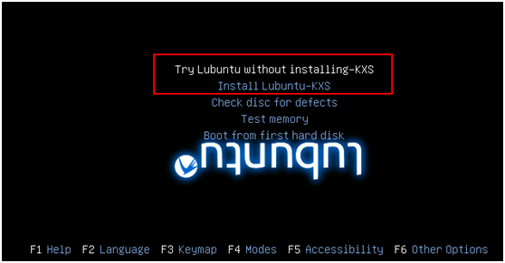 </br>
简体中文界面：  
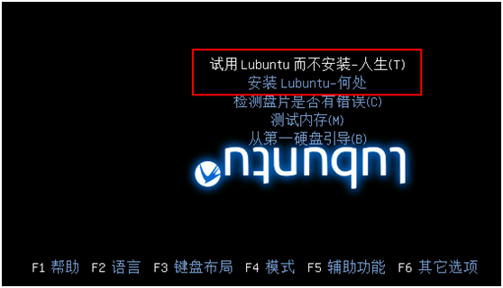 </br>
繁体中文界面：  
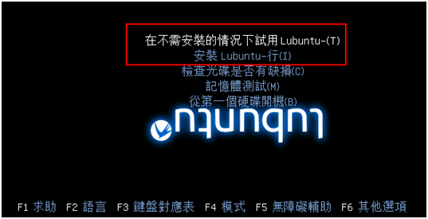 </br>
从图中看到，繁体中文效果不佳，原因未知，个人猜测和文字长度或者编码格式有关。  
另外在测试中发现，即使是简体中文，如果字符串长度太长，也会显示不正常。

## 4.4 修改终端效果
lubuntu使用的终端是lxterminal，其配置文件目录为：  
/usr/share/lxterminal/  
配置文件为（如终端默认字体、字体大小）：  
/usr/share/lxterminal/lxterminal.conf  
修改该文件即可对lxterminal进行定制，修改示例：  
```
[general]
fontname=Ubuntu Mono 11
selchars=-A-Za-z0-9,./?%&#:_
scrollback=100
```
修改的是fontname这一行。  
说明：这是修改GUI的终端配置（字体选择和字体大小）。效果如下图红框所示。  
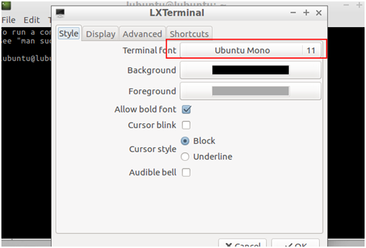 </br>
说明：默认为Monospace 10，现改为Monospace 11。  

## 4.5 修改鼠标样式
使用chroot进入squashfs-root目录。  
```
rm /etc/alternatives/x-cursor-theme
ln -s /usr/share/icons/DMZ-Black/cursor.theme /etc/alternatives/x-cursor-theme
```
此方法修改无效果，请参考下文。笔者认为理论上应该修改正确了，但却不生效，原因待查。  

## 4.6 修改桌面图标
lubuntu的桌面图标配置文件目录是：squashfs-root/usr/share/applications/，配置文件以.desktop结尾。  
默认情况下启动，桌面会有安装系统的图标。下面修改图标的显示文字。  
修改文件：squashfs-root/usr/share/applications/ubiquity.desktop  
将  
```
安裝 RELEASE
```
改为  
```
安装我的！系统！ RELEASE
```
也可以修改为其它想显示的字符。重新制作ISO，启动ISO后，桌面出现效果如下：  
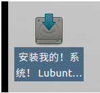 </br>
说明：通过修改配置文件，可以定制桌面图标显示的文字。  

## 4.7 放置图标快捷到桌面
为了方便在桌面直接双击打开程序，需要放程序图标放到桌面上。  
使用chroot进入squashfs-root目录。  
创建/etc/skel/Desktop目录，将需要显示到桌面的图标文件拷贝到该目录。下面将firefox和终端快捷方式放到桌面：  
```
mkdir -p /etc/skel/Desktop
cd /etc/skel/Desktop/
cp /usr/share/applications/firefox.desktop .
cp /usr/share/applications/lxterminal.desktop .
chmod +x *
```
效果如下：  
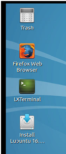 </br>

说明：此方式适用于默认lubuntu用户的情况。（注意和以下方式有区别，如果使用自添加用户的话，则本节设置方法无效）  
知识点：  
/etc/skel/是新加用户时，该用户拥有的设置，系统启动时，会创建lubuntu用户，则这个目录的内容将会拷贝到lubuntu的home目录。

## 4.8 新加home目录和根目录到桌面
默认情况下，桌面是没有home目录和根目录的图标的。
根据《放置图标快捷到桌面》一节的启示，只要找到home目录的图标配置文件，将其放到/etc/skel/Desktop/，就能在桌面显示了。  
lubuntu文件系统管理使用pcmanfm工具，其桌面配置文件为：  
/usr/share/applications/pcmanfm.desktop  
将该文件拷贝一份，重命名为pcmanfm_home.desktop（表示是home目录），要修改的内容如下（下面的内容已修改）：  
```
Icon=system-file-manager # 在桌面上的图案名称（需要搜索目录以确认要添加的图标名）
Name=Home # 显示的图标名（英文系统显示图标名称）
Name[zh_CN]=家目录 # 中文系统图标名
Name[zh_TW]=家目录 # 繁体系统图标名
Exec=pcmanfm %U # 要执行的命名，注：%U表示本次登陆的用户的home目录
```
再重新拷贝一份，重命名为pcmanfm_rootfs.desktop（表示是根目录），要修改的内容如下（下面的内容已修改）：  
```
Icon=system-file-manager
Name=File System
Name[zh_CN]=根目录
Name[zh_TW]=根目录
Exec=pcmanfm /
```
内容注释参考前面，不再赘述。  

效果如下图所示：  
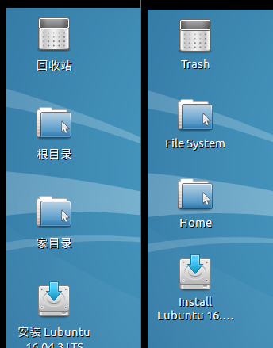 </br>
（注：左为中文，右为英文，可以看到两者图标间距不同，猜测是字符编码原因，也可能是笔者截图导致的视觉误差。）
## 4.9 新加锁屏
lubuntu默认使用lxlock作为锁屏工具。这里使用另一种锁屏方案：xlock。xlock官网为：[http://www.sillycycle.com/xlockmore.html](http://www.sillycycle.com/xlockmore.html)，源码下载地址为：[http://www.sillycycle.com/xlock/](http://www.sillycycle.com/xlock/)。  
但是，笔者没有编译通过。限于时间，就直接使用livecd里面的xlock来实现。  
实现方法：  
1、将livecd的xlock和xlockless拷贝出来，再拷贝到/usr/bin目录，并修改其权限为777。  
2、添加桌面图标文件xlock.desktop（参考/usr/share/applications/lubuntu-screenlock.desktop文件进行修改），内容如下：  
```
[Desktop Entry]
Icon=system-lock-screen
Exec=lxlockless
Type=Application
Categories=GTK;System;Utility;

Name=ScreenLock
Name[zh_CN]=锁屏
Name[zh_TW]=锁屏
```
注：Categories项的内容决定于图标显示在启动菜单的位置。Name为显示的名字（不同国家语言，显示的名字不同）  
3、将xlock.desktop拷贝到/etc/skel/Desktop目录  
4、安装缺少的工具：  
```
apt-get install -y rxvt-unicode
```
5、由于xlock不是在本地编译的，其使用的链接器文件为/lib/ld-linux-x86-64.so.2，而x64平台的链接器为/lib64/ld-linux-x86-64.so.2，因此需要额外拷贝一份，命令如下：
```
cp /lib64/ld-linux-x86-64.so.2 /lib/
```
重启制作ISO，启动，在桌面上会看到锁屏图标，双击，然后输入2次相同的密码，就会锁屏（此时屏幕是黑色的）。按任意键后，在出现的界面中输入刚才的密码，即能解锁。效果图如下：  
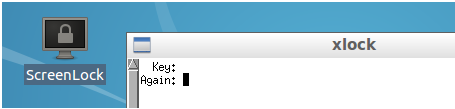 </br>


## 4.10 启动菜单添加新图标
在桌面左下角启动菜单新加项目，不需要修改panel相关文件。以新加的锁屏功能放到System Tools分类为例，在.desktop文件中关键的语句为：  
```
Categories=GTK;System;Utility;
```
效果图如下（左侧中文，右侧英文）：  
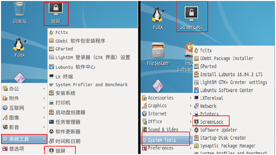 </br>
注意，菜单中显示的图标上的文字，由.desktop文件的Name决定。  

## 4.11 启动菜单添加新分类
以安装的vim添加到编程分类为例进行说明。  
用apt-get install vim方式安装vim后，会自动在/usr/share/applications目录下创建vim.desktop文件。  
将其拷贝一份，重命名为myvim.desktop，修改Categories，由  
```
Categories=Utility;TextEditor;
```
改为
```
Categories=Development;Programming;  
```
为了与vim.desktop作区别，修改名称，如下：  
```
Name=MyVim
GenericName=My Text Editor
```
重新制作ISO，启动后，效果图如下（左侧英文，右侧中文）  
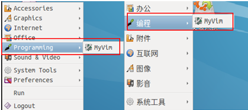 </br>

总结：不管是新安装的软件还是系统已有的软件，如果要显示在桌面或菜单，都需要添加(或修改).desktop文件。放到桌面上，则要将.desktop文件拷贝到Desktop目录，菜单分类则需要将Categories修改为合适的字段。至于显示的名称，则由该文件的Name字段确定。参考其它的.desktop文件，进行学习了解。  

## 4.12 添加用户：普通用户latelee
使用chroot进入squashfs-root目录。  
```
adduser latelee (回车，然后输入2次密码，一路回车即可)  
```
将用户添加root权限： 
```
addgroup -system admin
adduser latelee admin
```
命令说明：首先添加admin组，将latelee用户添加到admin组。  

注：添加用户后，启动ISO时，会提示输入用户名密码，所以无法直接进入系统，是否需要此功能，三思而定。  
登陆效果图如下：  
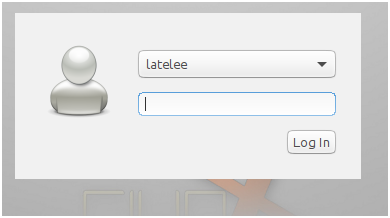 </br>
在此前提下，创建桌面快捷方式：  
创建文件：/home/latelee/Desktop/lxterminal.desktop。Desktop目录默认没有，需要自行创建。  
内容如下：  
```
[Desktop Entry]
Type=Link
Name=LXTerminal
Icon=lxterminal
URL=/usr/share/applications/lxterminal.desktop
```
启动ISO，登陆后，桌面有图标出现。想要其它桌面图标，操作同理。桌面“快捷方式”位于/usr/share/applications/目录下。  

说明：这个操作主要是在ISO光盘添加一个用户，并以该用户运行系统。如果想要默认的lubuntu用户，则不需要新加用户。  

```
《《《《《《《《《《《《《《《《《《《《《《《《《《《《《《《TMPTMPTMPTMP

/etc/lightdm/lightdm-gtk-greeter.conf.d/30_lubuntu.conf

修改该文件，无效果。
[greeter]
logo=/usr/share/icons/lubuntu/places/64/start-here.svg
background=/usr/share/lubuntu/wallpapers/lubuntu-default-wallpaper.png
theme-name=Lubuntu-default
icon-theme-name=lubuntu
font-name=Ubuntu
xft-antialias=true
#xft-dpi=
xft-hintstyle=full
xft-rgba=rgb

》》》》》》》》》》》》》》》》》》》》》》》》》》》》》》》》》》》》》TMPTMPTMPTMP
```

## 4.13 添加用户：root用户
添加root密码：  
```
# passwd root
```
TODO:经尝试，不生效。原因待查。  

## 4.14 修改主题、鼠标样式
下面是一种折中的方法。最好的方案暂时未找到。  
使用livecd启动，开机，用默认的lubuntu用户登陆，先修改好自己想要的主题、鼠标样式，设置好桌面上显示的图标，之后得到配置文件在/home/lubuntu/目录(在.config和.icons目录)，将这个目录做成压缩包（lubunut.tar.bz2），然后拷贝到制作ISO镜像的主机（建议用scp通过ssh来拷贝，快速）。  
在主机上，将上面lubuntu目录压缩包（lubunut.tar.bz2）解压出来（本示例是放到work/lubuntu目录），拷贝到目录squashfs-root/etc/skel/。下面是一个示例(注：下面命令的当前目录在iso，work目录存放一些配置文件、图片等，squashfs-root是iso文件系统所在目录)。  
拷贝主题、字体，等等：  
```
cp work/lubuntu/.config/ squashfs-root/etc/skel/ -a
```
拷贝鼠标样式：  
```
cp -a work/lubuntu/.icons/ squashfs-root/etc/skel/
```
拷贝桌面图标：  
```
cp -a work/lubuntu/Desktop/ squashfs-root/etc/skel/
```
注意，为了防止权限问题造成无法读取文件，需要执行以下命令更改权限：  
```
chroot squashfs-root # 进入chroot环境
chmod 777 squashfs-root/etc/skel/.* -R
exit #退出chroot环境。
```
最后，制作光盘ISO，启动新的ISO，即可看到修改后的效果。  
总结：  
因为squashfs-root/etc/skel/存放的是默认用户lubuntu的配置文件，因此，只要将我们想要的效果配置文件拷贝到对应的位置即可（如.config、.icons）。  

知识点：  
work/lubuntu/.config/gtk-3.0/settings.ini：主题、字体大小、鼠标样式  
work/lubuntu/.config/lxsession/Lubuntu/desktop.conf：桌面配置（主题、字体大小、鼠标样式）  
work/lubuntu/.config/lxterminal/lxterminal.conf：终端配置  
work/lubuntu/.icons/user-dirs.dirs：里面是home目录的默认目录（video等）  
work/lubuntu/.icons/default/index.theme：主题  
（为什么主题配置要写那么多文件，笔者也不懂>_>）  

## 4.15 修改时区
livecd默认是UTC时间，为了方便定制与实际时间对应起来，需要修改默认的时区。  
使用chroot进入squashfs-root目录。将所需时区文件链接到/etc/localtime文件。下面示例是设置系统时间为东八区（上海）：  
```
rm /etc/localtime
ln -s /usr/share/zoneinfo/Asia/Shanghai /etc/localtime
```

## 4.16 添加环境变量
使用chroot进入squashfs-root目录。  
编辑文件/etc/bash.bashrc，在文件最后添加想要的环境变量或命令别名。比如默认是没有ll命令的，则可以添加：  
```
alias ll='ls -alF'
alias la='ls -A'
alias l='ls -CF'
```
测试：即时生效：source /etc/bash.bashrc，然后输入ll即可看到生效了。  

说明：修改这个文件，主要是方便定制一些命令。如果没有这方面的需要，则不用理会。  

## 4.17 系统汉化
lubuntu默认情况下已经有部分界面汉化了，但不完整。系统的汉化需要对应语言包的支持（需要哪种语言则安装哪个语言支持包）。本节安装的是简体中文、繁体中文。语言包由世界各国志愿者维护（即每种语言，都需要人工进行翻译，放到mo或po文件里面）。  
使用chroot进入squashfs-root，安装简体中文语言支持包：  
```
apt-get install -y language-pack-zh-hans language-pack-gnome-zh-hans
```
繁体中文支持包：  
```
apt-get install -y language-pack-zh-hant language-pack-gnome-zh-hant
```
英文包（注：默认已经安装了，所以会提示“升级”而不是安装）  
```
apt-get install -y language-pack-en language-pack-gnome-en
```
下面对比原版和定制版本的效果：  
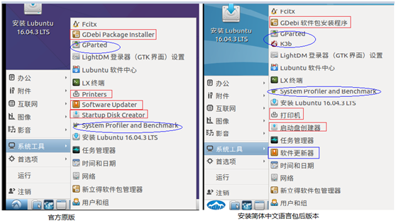 </br>
从图中看到，有部分已经进行了汉化，但有部分依然没有被汉化。根据网络为数不多的资料猜测，应该是语言包并没有全部翻译造成的。如果要完全汉化，只能通过修改语言包文件达到目的，虽然4.18小节讲述了语言文件的修改方法，但整体而言，语言包的翻译是一个大工程，已超过本文范围了，故不再深入讲解。  

## 4.18 语言文件修改
前面安装的语言包，实际上将mo文件放到合适的位置。不同语言，“合适的位置”也不同。  
简体中文的mo文件位置：/usr/share/locale/zh_CN/LC_MESSAGES/  
繁体中文：/usr/share/locale/zh_TW/LC_MESSAGES/  
英文系统：/usr/share/locale/en/LC_MESSAGES/（注：似乎英文是天然支持的，因此该目录下的mo文件并不多。）  
mo文件是二进制文件，无法直接修改，需要将其转换成po文件，修改po文件，再将其转成mo，这样才能完成更新的操作。  
下面是文件系统管理器pcmanfm的语言文件为例说明。  
找到/usr/share/locale/zh_CN/LC_MESSAGES/pcmanfm.mo，使用以下命令转换po文件：  
```
msgunfmt pcmanfm.mo -o pcmanfm.po
```
然后编辑pcmanfm.po文件，此处修改示例如下： 
```
msgid "translator-credits"
msgstr "Wylmer Wang <wantinghard@gmail.com>\nLate Lee <li@latelee.org>"

msgid "using LibFM ver. %s\n"
msgstr "--我的--使用 LibFM 版本 %s\n"
```
然后再转换成mo文件：  
```
msgfmt pcmanfm.po -o pcmanfm.mo
```
将重新生成的pcmanfm.mo拷贝到原处，制作ISO，启动，选择简体中文。得到的效果图如下所示：  
 </br>

## 4.19 添加拼音、五笔输入法
安装fcitx拼音、五笔： 
```
apt-get update # 更新源
apt-get install -y fcitx-pinyin fcitx-table-wubi fcitx-table-wbpy # 依次是拼音、五笔、五笔拼音
```
另外，网上有说法要添加以下源：  
```
add-apt-repository ppa:fcitx-team/stable
```
经测试，不添加也可以正常安装。  

输入法选择界面：  
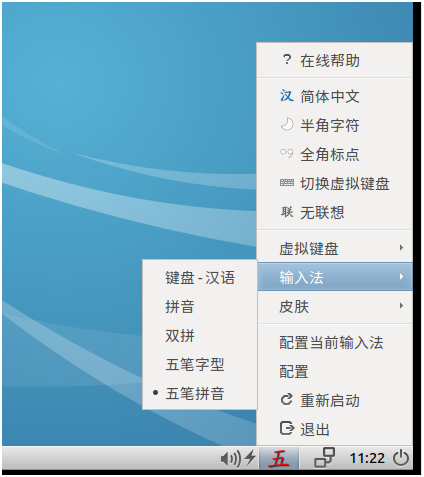 </br>
五笔输入界面：  
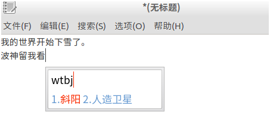 </br>
fcitx拼音、五笔在中文环境才能显示出来，英文环境无法使用。  

注：fcitx从源码安装十分麻烦，依赖库有十多个，详细参考以下文章：  
[https://fcitx-im.org/wiki/Compile_from_source](https://fcitx-im.org/wiki/Compile_from_source)


## 4.20 删除软件安装途径
为防止源更新，需要删除ISO安装软件的途径。安装软件的途径有：apt、dpkg、新立得（synpatic）、软件中心。只要将其删除掉，则在启动ISO时就无法再安装软件了。  

使用chroot进入squashfs-root目录。  
卸载synpatic:  
```
apt-get autoremove -y synaptic
```
卸载软件中心：  
```
apt-get autoremove -y lubuntu-software-center
```
卸载gdebi：  
```
apt-get autoremove -y gdebi gdebi-gtk
```
卸载软件更新：  
```
apt-get autoremove -y software-properties-gtk update-manager
```

删除apt、dpkg：  
```
rm -rf $(find /usr -name "*dpkg*") $(find /usr -name "*apt*")
rm -rf $(find /etc -name "*dpkg*") $(find /etc -name "*apt*")
```
命令解释：删除所有带“dpkg”、“apt”字样的文件。  

注意，此操作具备一定危险，需要谨慎操作。如果不是在chroot环境，会将主机的dpkg和apt删除掉。三思而定。  


# 5、最终定制效果及ISO下载
定制效果图如下： 
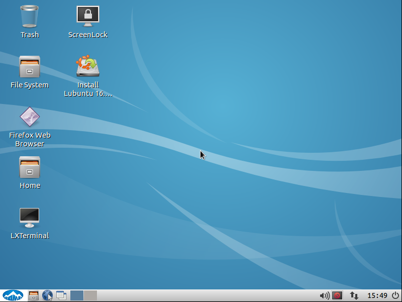 </br>

本工程定制的ISO镜像下载地址如下：  
链接: [https://pan.baidu.com/s/1jJ7bRNo](https://pan.baidu.com/s/1jJ7bRNo) 密码: 5c1u  
md5sum：4ac0996167214e0b541be7016be19220  

关于本文任何问题或建议，欢迎反馈给我：li@latelee.org。  

# 6、免责声明
本文开源于此，旨在让自己（或他人）更深入地研究lubuntu(以及linux)系统内部结构及原理。lubuntu、ubuntu、linux的商标(和版权)归属各自所属组织/公司，笔者无意亦不愿侵犯。

# 7、附


在lubuntu安装不同国家（地区）的语言包，则可显示该国（地区）文字，完整的语言支持包列表如下：
```
language-pack-af                  language-pack-gnome-ka            language-pack-kde-pl
language-pack-af-base             language-pack-gnome-ka-base       language-pack-kde-pt
language-pack-am                  language-pack-gnome-kk            language-pack-kde-ro
language-pack-am-base             language-pack-gnome-kk-base       language-pack-kde-ru
language-pack-an                  language-pack-gnome-km            language-pack-kde-si
language-pack-an-base             language-pack-gnome-km-base       language-pack-kde-sk
language-pack-ar                  language-pack-gnome-kn            language-pack-kde-sl
language-pack-ar-base             language-pack-gnome-kn-base       language-pack-kde-sr
language-pack-as                  language-pack-gnome-ko            language-pack-kde-sv
language-pack-as-base             language-pack-gnome-ko-base       language-pack-kde-tg
language-pack-ast                 language-pack-gnome-ku            language-pack-kde-th
language-pack-ast-base            language-pack-gnome-ku-base       language-pack-kde-tr
language-pack-az                  language-pack-gnome-lt            language-pack-kde-ug
language-pack-az-base             language-pack-gnome-lt-base       language-pack-kde-uk
language-pack-be                  language-pack-gnome-lv            language-pack-kde-vi
language-pack-be-base             language-pack-gnome-lv-base       language-pack-kde-zh-hans
language-pack-bg                  language-pack-gnome-mai           language-pack-kde-zh-hant
language-pack-bg-base             language-pack-gnome-mai-base      language-pack-kk
language-pack-bn                  language-pack-gnome-mk            language-pack-kk-base
language-pack-bn-base             language-pack-gnome-mk-base       language-pack-km
language-pack-bo                  language-pack-gnome-ml            language-pack-km-base
language-pack-bo-base             language-pack-gnome-ml-base       language-pack-kn
language-pack-br                  language-pack-gnome-mn            language-pack-kn-base
language-pack-br-base             language-pack-gnome-mn-base       language-pack-ko
language-pack-bs                  language-pack-gnome-mr            language-pack-ko-base
language-pack-bs-base             language-pack-gnome-mr-base       language-pack-ku
language-pack-ca                  language-pack-gnome-ms            language-pack-ku-base
language-pack-ca-base             language-pack-gnome-ms-base       language-pack-lt
language-pack-crh                 language-pack-gnome-my            language-pack-lt-base
language-pack-crh-base            language-pack-gnome-my-base       language-pack-lv
language-pack-cs                  language-pack-gnome-nb            language-pack-lv-base
language-pack-cs-base             language-pack-gnome-nb-base       language-pack-mai
language-pack-cy                  language-pack-gnome-nds           language-pack-mai-base
language-pack-cy-base             language-pack-gnome-nds-base      language-pack-mk
language-pack-da                  language-pack-gnome-ne            language-pack-mk-base
language-pack-da-base             language-pack-gnome-ne-base       language-pack-ml
language-pack-de                  language-pack-gnome-nl            language-pack-ml-base
language-pack-de-base             language-pack-gnome-nl-base       language-pack-mn
language-pack-dz                  language-pack-gnome-nn            language-pack-mn-base
language-pack-dz-base             language-pack-gnome-nn-base       language-pack-mr
language-pack-el                  language-pack-gnome-oc            language-pack-mr-base
language-pack-el-base             language-pack-gnome-oc-base       language-pack-ms
language-pack-en                  language-pack-gnome-or            language-pack-ms-base
language-pack-en-base             language-pack-gnome-or-base       language-pack-my
language-pack-eo                  language-pack-gnome-pa            language-pack-my-base
language-pack-eo-base             language-pack-gnome-pa-base       language-pack-nb
language-pack-es                  language-pack-gnome-pl            language-pack-nb-base
language-pack-es-base             language-pack-gnome-pl-base       language-pack-nds
language-pack-et                  language-pack-gnome-pt            language-pack-nds-base
language-pack-et-base             language-pack-gnome-pt-base       language-pack-ne
language-pack-eu                  language-pack-gnome-ro            language-pack-ne-base
language-pack-eu-base             language-pack-gnome-ro-base       language-pack-nl
language-pack-fa                  language-pack-gnome-ru            language-pack-nl-base
language-pack-fa-base             language-pack-gnome-ru-base       language-pack-nn
language-pack-fi                  language-pack-gnome-si            language-pack-nn-base
language-pack-fi-base             language-pack-gnome-si-base       language-pack-oc
language-pack-fr                  language-pack-gnome-sk            language-pack-oc-base
language-pack-fr-base             language-pack-gnome-sk-base       language-pack-or
language-pack-ga                  language-pack-gnome-sl            language-pack-or-base
language-pack-ga-base             language-pack-gnome-sl-base       language-pack-pa
language-pack-gd                  language-pack-gnome-sq            language-pack-pa-base
language-pack-gd-base             language-pack-gnome-sq-base       language-pack-pl
language-pack-gl                  language-pack-gnome-sr            language-pack-pl-base
language-pack-gl-base             language-pack-gnome-sr-base       language-pack-pt
language-pack-gnome-af            language-pack-gnome-sv            language-pack-pt-base
language-pack-gnome-af-base       language-pack-gnome-sv-base       language-pack-ro
language-pack-gnome-am            language-pack-gnome-ta            language-pack-ro-base
language-pack-gnome-am-base       language-pack-gnome-ta-base       language-pack-ru
language-pack-gnome-an            language-pack-gnome-te            language-pack-ru-base
language-pack-gnome-an-base       language-pack-gnome-te-base       language-pack-si
language-pack-gnome-ar            language-pack-gnome-tg            language-pack-si-base
language-pack-gnome-ar-base       language-pack-gnome-tg-base       language-pack-sk
language-pack-gnome-as            language-pack-gnome-th            language-pack-sk-base
language-pack-gnome-as-base       language-pack-gnome-th-base       language-pack-sl
language-pack-gnome-ast           language-pack-gnome-tr            language-pack-sl-base
language-pack-gnome-ast-base      language-pack-gnome-tr-base       language-pack-sq
language-pack-gnome-az            language-pack-gnome-ug            language-pack-sq-base
language-pack-gnome-az-base       language-pack-gnome-ug-base       language-pack-sr
language-pack-gnome-be            language-pack-gnome-uk            language-pack-sr-base
language-pack-gnome-be-base       language-pack-gnome-uk-base       language-pack-sv
language-pack-gnome-bg            language-pack-gnome-uz            language-pack-sv-base
language-pack-gnome-bg-base       language-pack-gnome-uz-base       language-pack-ta
language-pack-gnome-bn            language-pack-gnome-vi            language-pack-ta-base
language-pack-gnome-bn-base       language-pack-gnome-vi-base       language-pack-te
language-pack-gnome-bo            language-pack-gnome-xh            language-pack-te-base
language-pack-gnome-bo-base       language-pack-gnome-xh-base       language-pack-tg
language-pack-gnome-br            language-pack-gnome-zh-hans       language-pack-tg-base
language-pack-gnome-br-base       language-pack-gnome-zh-hans-base  language-pack-th
language-pack-gnome-bs            language-pack-gnome-zh-hant       language-pack-th-base
language-pack-gnome-bs-base       language-pack-gnome-zh-hant-base  language-pack-touch-ast
language-pack-gnome-ca            language-pack-gu                  language-pack-touch-bg
language-pack-gnome-ca-base       language-pack-gu-base             language-pack-touch-bs
language-pack-gnome-crh           language-pack-he                  language-pack-touch-ca
language-pack-gnome-crh-base      language-pack-he-base             language-pack-touch-cs
language-pack-gnome-cs            language-pack-hi                  language-pack-touch-da
language-pack-gnome-cs-base       language-pack-hi-base             language-pack-touch-de
language-pack-gnome-cy            language-pack-hr                  language-pack-touch-el
language-pack-gnome-cy-base       language-pack-hr-base             language-pack-touch-en
language-pack-gnome-da            language-pack-hu                  language-pack-touch-es
language-pack-gnome-da-base       language-pack-hu-base             language-pack-touch-eu
language-pack-gnome-de            language-pack-ia                  language-pack-touch-fi
language-pack-gnome-de-base       language-pack-ia-base             language-pack-touch-fr
language-pack-gnome-dz            language-pack-id                  language-pack-touch-gd
language-pack-gnome-dz-base       language-pack-id-base             language-pack-touch-gl
language-pack-gnome-el            language-pack-is                  language-pack-touch-he
language-pack-gnome-el-base       language-pack-is-base             language-pack-touch-hr
language-pack-gnome-en            language-pack-it                  language-pack-touch-hu
language-pack-gnome-en-base       language-pack-it-base             language-pack-touch-id
language-pack-gnome-eo            language-pack-ja                  language-pack-touch-it
language-pack-gnome-eo-base       language-pack-ja-base             language-pack-touch-ja
language-pack-gnome-es            language-pack-ka                  language-pack-touch-ko
language-pack-gnome-es-base       language-pack-ka-base             language-pack-touch-lt
language-pack-gnome-et            language-pack-kde-ar              language-pack-touch-lv
language-pack-gnome-et-base       language-pack-kde-bg              language-pack-touch-ms
language-pack-gnome-eu            language-pack-kde-bs              language-pack-touch-nb
language-pack-gnome-eu-base       language-pack-kde-ca              language-pack-touch-nl
language-pack-gnome-fa            language-pack-kde-cs              language-pack-touch-oc
language-pack-gnome-fa-base       language-pack-kde-da              language-pack-touch-pa
language-pack-gnome-fi            language-pack-kde-de              language-pack-touch-pl
language-pack-gnome-fi-base       language-pack-kde-el              language-pack-touch-pt
language-pack-gnome-fr            language-pack-kde-en              language-pack-touch-ro
language-pack-gnome-fr-base       language-pack-kde-es              language-pack-touch-ru
language-pack-gnome-ga            language-pack-kde-et              language-pack-touch-sk
language-pack-gnome-ga-base       language-pack-kde-eu              language-pack-touch-sl
language-pack-gnome-gd            language-pack-kde-fa              language-pack-touch-sr
language-pack-gnome-gd-base       language-pack-kde-fi              language-pack-touch-sv
language-pack-gnome-gl            language-pack-kde-fr              language-pack-touch-tr
language-pack-gnome-gl-base       language-pack-kde-ga              language-pack-touch-ug
language-pack-gnome-gu            language-pack-kde-gl              language-pack-touch-uk
language-pack-gnome-gu-base       language-pack-kde-he              language-pack-touch-zh-hans
language-pack-gnome-he            language-pack-kde-hi              language-pack-touch-zh-hant
language-pack-gnome-he-base       language-pack-kde-hr              language-pack-tr
language-pack-gnome-hi            language-pack-kde-hu              language-pack-tr-base
language-pack-gnome-hi-base       language-pack-kde-ia              language-pack-ug
language-pack-gnome-hr            language-pack-kde-is              language-pack-ug-base
language-pack-gnome-hr-base       language-pack-kde-it              language-pack-uk
language-pack-gnome-hu            language-pack-kde-ja              language-pack-uk-base
language-pack-gnome-hu-base       language-pack-kde-kk              language-pack-uz
language-pack-gnome-ia            language-pack-kde-km              language-pack-uz-base
language-pack-gnome-ia-base       language-pack-kde-ko              language-pack-vi
language-pack-gnome-id            language-pack-kde-lt              language-pack-vi-base
language-pack-gnome-id-base       language-pack-kde-lv              language-pack-xh
language-pack-gnome-is            language-pack-kde-mr              language-pack-xh-base
language-pack-gnome-is-base       language-pack-kde-nb              language-pack-zh-hans
language-pack-gnome-it            language-pack-kde-nds             language-pack-zh-hans-base
language-pack-gnome-it-base       language-pack-kde-nl              language-pack-zh-hant
language-pack-gnome-ja            language-pack-kde-nn              language-pack-zh-hant-base
language-pack-gnome-ja-base       language-pack-kde-pa
```